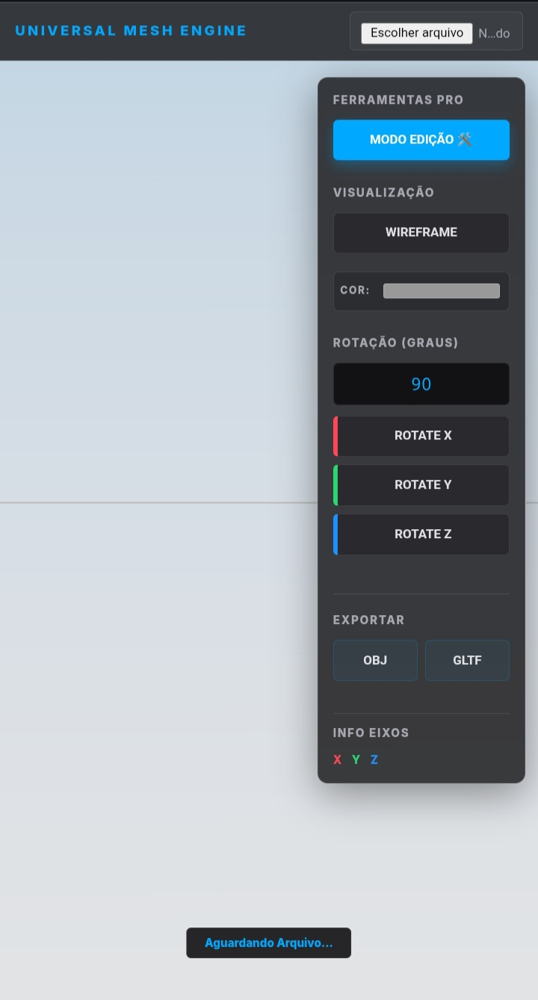
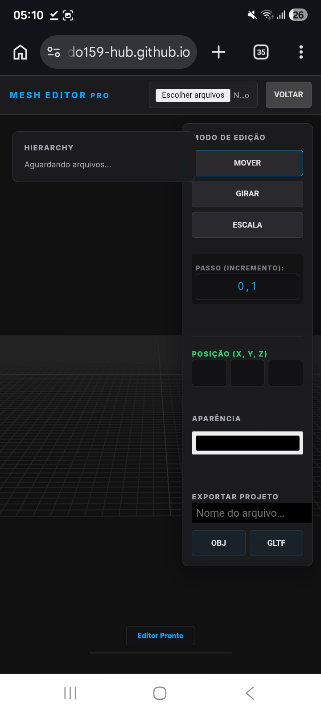

# 🧊 Universal Mesh Engine PRO

Uma ferramenta poderosa e leve baseada em WebGL (Three.js) para visualização, manipulação e conversão de arquivos de malha (.mesh / .rbxm). Projetada com uma interface moderna inspirada em softwares de modelagem profissional como Roblox Studio e Blender.

> [!TIP]
> ### 🌐 Preview ao Vivo
> Clique no link abaixo para abrir a engine diretamente no seu navegador:
> **[ABRIR ENGINE AGORA 🚀](https://kauericardo159-hub.github.io/View-Model/)**

---

## 🖥️ Demonstração em Tempo Real

<p align="center">
  <kbd>
    
  </kbd>
</p>

<p align="center">
  
  
</p>

---

## ✨ Funcionalidades

- **🛠️ Novo: Modo Edição Pro:**
  - Manipule múltiplos objetos simultaneamente.
  - Ferramentas de **Mover (G), Girar (R) e Escalar (S)** com Gizmos (eixos) estilo Roblox Studio.
  - Sistema de **Hierarchy** (Lista de objetos) para deletar e selecionar peças.
  - Opção de **Juntar (Merge)** várias peças em um único arquivo final.

- **Visualização Avançada:** Suporte para renderização de alta performance com mapeamento de tons ACES Filmic.
- **Manipulação Estilo Engine:**
  - Sistema de rotação por eixos (X, Y, Z) com precisão de graus configurável.
  - Alternância de modo Wireframe para inspeção de topologia.
  - Seletor de cores em tempo real para o material da mesh.
- **Conversão e Exportação:**
  - Converta seus modelos carregados para formatos padrão da indústria: **OBJ** e **GLTF**.
- **Interface Inteligente:** Layout "Inspector" otimizado com suporte a blur (glassmorphism).

## 🛠️ Tecnologias Utilizadas

* [Three.js](https://threejs.org/) - Engine 3D para Web.
* [JavaScript ES6+](https://developer.mozilla.org/pt-BR/docs/Web/JavaScript) - Lógica principal e Workers.
* [HTML5/CSS3](https://developer.mozilla.org/pt-BR/docs/Web/CSS) - UI responsiva e moderna.

## 🚀 Como Usar

1. **Upload:** Clique no botão superior para carregar seus arquivos `.mesh`, `.rbxm` ou `.obj`.
2. **Modo Edição:** Alterne para o Modo Edição para montar cenas complexas.
3. **Ajustar:** Use as ferramentas de Mover, Girar ou Redimensionar. Defina o **Incremento (Snap)** para movimentos precisos.
4. **Exportar:** Digite o nome do arquivo e clique em **JUNTAR** para baixar o projeto completo.

## 📦 Instalação Local

Se desejar rodar o projeto localmente:

1. Clone o repositório:
   ```bash
   git clone [https://github.com/kauericardo159-hub/View-Model.git](https://github.com/kauericardo159-hub/View-Model.git)
